# 架构与流程详解

> 本文档是对整个 AI Agent 框架的全面分析，包含架构总览、组件关系、数据流和各子系统的详细流程图。

---

## 目录

1. [系统总览](#1-系统总览)
2. [分层架构](#2-分层架构)
3. [组件依赖与组装](#3-组件依赖与组装)
4. [请求处理主流程](#4-请求处理主流程)
5. [图引擎执行流程](#5-图引擎执行流程)
6. [智能体系统](#6-智能体系统)
7. [工具系统](#7-工具系统)
8. [记忆系统](#8-记忆系统)
9. [规划系统](#9-规划系统)
10. [MCP 集成](#10-mcp-集成)
11. [技能系统](#11-技能系统)
12. [守卫系统](#12-守卫系统)

---

## 1. 系统总览

本框架是一个从零构建的多智能体编排系统，核心设计原则：

- **端口-适配器架构**：所有可插拔组件通过 Protocol 定义接口
- **集中组装**：所有具体实现仅在 `bootstrap.py` 中实例化
- **LLM 驱动路由**：智能体间的路由完全由 LLM 决策（通过 `transfer_to_*` 工具），无静态边连接
- **懒加载**：MCP 连接、分类智能体创建、工具 Schema 加载均延迟到首次使用
- **共享黑板状态**：`DynamicState(extra="allow")` 让每个节点的输出可被后续节点读取

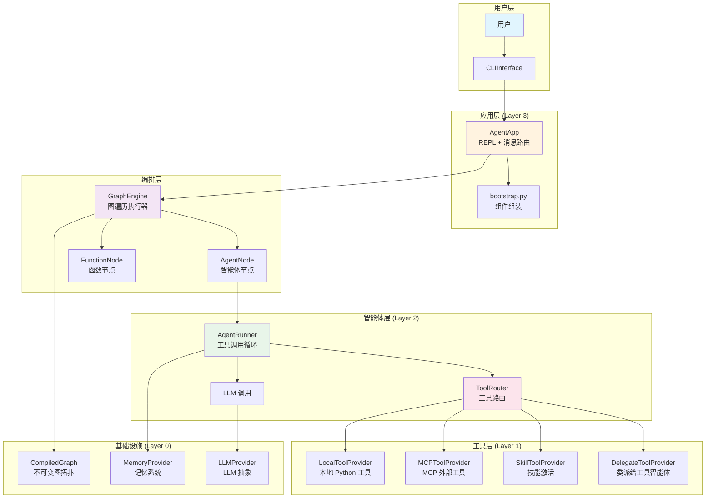
```mermaid
graph TB
    subgraph "用户层"
        USER[用户] --> CLI[CLIInterface]
    end

    subgraph "应用层 (Layer 3)"
        CLI --> APP[AgentApp<br/>REPL + 消息路由]
        APP --> BOOT[bootstrap.py<br/>组件组装]
    end

    subgraph "编排层"
        APP --> GE[GraphEngine<br/>图遍历执行器]
        GE --> AN[AgentNode<br/>智能体节点]
        GE --> FN[FunctionNode<br/>函数节点]
    end

    subgraph "智能体层 (Layer 2)"
        AN --> RUNNER[AgentRunner<br/>工具调用循环]
        RUNNER --> LLM_CALL[LLM 调用]
        RUNNER --> TR[ToolRouter<br/>工具路由]
    end

    subgraph "工具层 (Layer 1)"
        TR --> LOCAL[LocalToolProvider<br/>本地 Python 工具]
        TR --> MCP_P[MCPToolProvider<br/>MCP 外部工具]
        TR --> SKILL_P[SkillToolProvider<br/>技能激活]
        TR --> DEL[DelegateToolProvider<br/>委派给工具智能体]
    end

    subgraph "基础设施 (Layer 0)"
        GE --> GRAPH[CompiledGraph<br/>不可变图拓扑]
        RUNNER --> MEM[MemoryProvider<br/>记忆系统]
        LLM_CALL --> LLM[LLMProvider<br/>LLM 抽象]
    end

    style USER fill:#e1f5fe
    style APP fill:#fff3e0
    style GE fill:#f3e5f5
    style RUNNER fill:#e8f5e9
    style TR fill:#fce4ec
```

---

## 2. 分层架构

### 2.1 层次结构

```
┌─────────────────────────────────────────────────────────────────┐
│                        Layer 3: 应用层                           │
│  src/app/bootstrap.py    组件组装（唯一实例化点）                    │
│  src/app/app.py          REPL 循环 + 消息路由                     │
│  src/app/presets.py      预设图构建（orchestrator + planner）       │
├─────────────────────────────────────────────────────────────────┤
│                     Layer 2: 领域逻辑层                           │
│  src/agents/             智能体模型、运行器、注册表                  │
│  src/memory/             ChromaDB 存储、事实提取、衰减              │
│  src/plan/               计划生成、编译、5 阶段流程                  │
│  src/mcp/                MCP 客户端、懒连接管理器                   │
│  src/skills/             技能发现、解析、激活                       │
├─────────────────────────────────────────────────────────────────┤
│                     Layer 1: 服务抽象层                           │
│  src/llm/                LLMProvider Protocol + OpenAI 实现       │
│  src/tools/              工具注册、执行、中间件、路由、分类           │
├─────────────────────────────────────────────────────────────────┤
│                     Layer 0: 基础设施层                           │
│  src/config.py           YAML + .env 配置加载                     │
│  src/utils/              性能计时、文本处理                         │
│  src/interfaces/         UserInterface Protocol + CLI 实现         │
│  src/graph/              图引擎（Builder + Engine + 类型）          │
│  src/guardrails/         输入/输出安全守卫                          │
└─────────────────────────────────────────────────────────────────┘
```

### 2.2 依赖规则

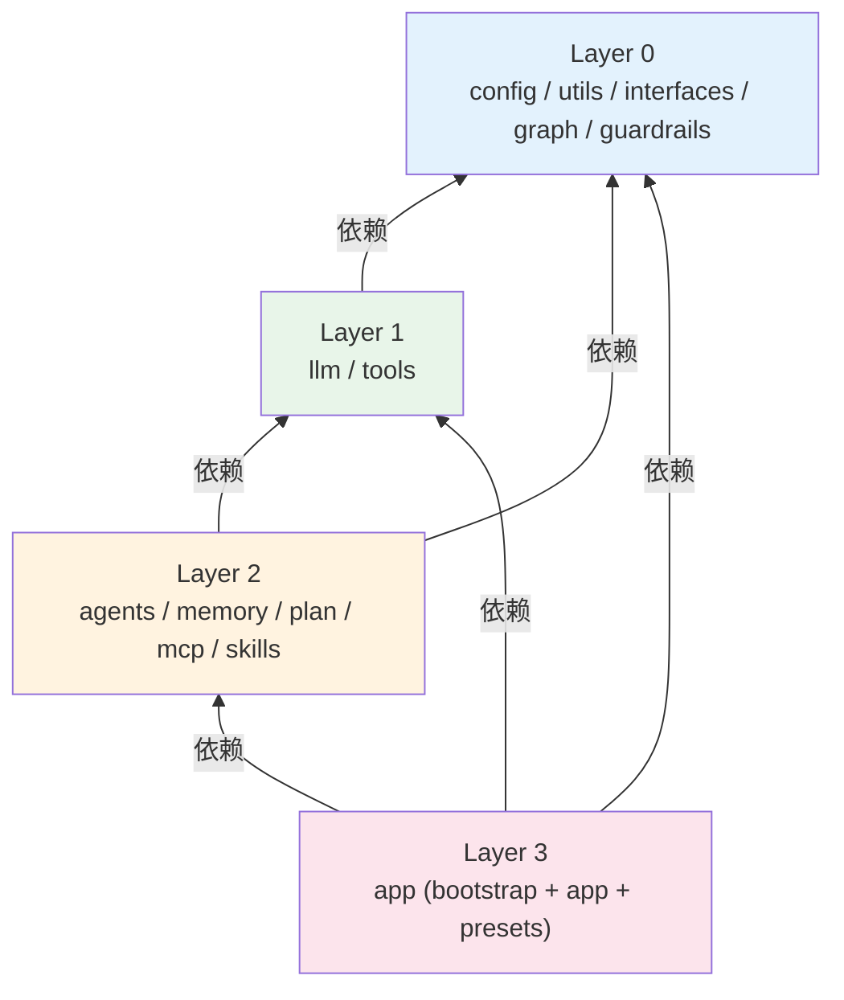
```mermaid
graph BT
    L0["Layer 0<br/>config / utils / interfaces / graph / guardrails"]
    L1["Layer 1<br/>llm / tools"]
    L2["Layer 2<br/>agents / memory / plan / mcp / skills"]
    L3["Layer 3<br/>app (bootstrap + app + presets)"]

    L1 -->|依赖| L0
    L2 -->|依赖| L0
    L2 -->|依赖| L1
    L3 -->|依赖| L0
    L3 -->|依赖| L1
    L3 -->|依赖| L2

    style L0 fill:#e3f2fd
    style L1 fill:#e8f5e9
    style L2 fill:#fff3e0
    style L3 fill:#fce4ec
```

**严格的单向依赖**：低层模块不得导入高层模块。`DelegateToolProvider`（Layer 1）通过运行时延迟导入（`TYPE_CHECKING` 守卫）访问 `AgentRunner`（Layer 2），避免编译期违规。

### 2.3 核心 Protocol 接口

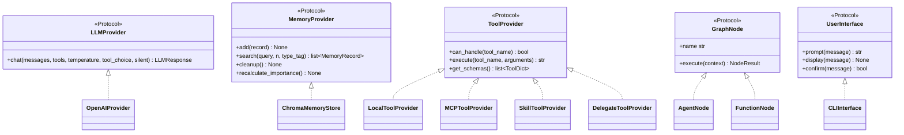
```mermaid
classDiagram
    class LLMProvider {
        <<Protocol>>
        +chat(messages, tools, temperature, tool_choice, silent) LLMResponse
    }

    class MemoryProvider {
        <<Protocol>>
        +add(record) None
        +search(query, n, type_tag) list~MemoryRecord~
        +cleanup() None
        +recalculate_importance() None
    }

    class ToolProvider {
        <<Protocol>>
        +can_handle(tool_name) bool
        +execute(tool_name, arguments) str
        +get_schemas() list~ToolDict~
    }

    class GraphNode {
        <<Protocol>>
        +name str
        +execute(context) NodeResult
    }

    class UserInterface {
        <<Protocol>>
        +prompt(message) str
        +display(message) None
        +confirm(message) bool
    }

    LLMProvider <|.. OpenAIProvider
    MemoryProvider <|.. ChromaMemoryStore
    ToolProvider <|.. LocalToolProvider
    ToolProvider <|.. MCPToolProvider
    ToolProvider <|.. SkillToolProvider
    ToolProvider <|.. DelegateToolProvider
    GraphNode <|.. AgentNode
    GraphNode <|.. FunctionNode
    UserInterface <|.. CLIInterface
```

---

## 3. 组件依赖与组装

### 3.1 Bootstrap 组装顺序

`bootstrap.py` 中的 `create_app()` 是整个系统的**唯一组装点**，按以下顺序构建：


```mermaid
flowchart TD
    START([create_app 开始]) --> CONFIG[1. 加载 config.yaml + .env]
    CONFIG --> LLM[2. 创建 OpenAIProvider<br/>streaming + on_chunk=ui.display]
    LLM --> TOOLS[3. 发现本地工具<br/>discover_tools → ToolRegistry]
    TOOLS --> MW[4. 构建中间件管道<br/>error → sensitive → truncate]
    MW --> LOCAL_P[5. 创建 LocalToolProvider<br/>Registry + Executor + Pipeline]
    LOCAL_P --> MCP_LOAD[6. 加载 MCP 配置<br/>mcp_servers.json → MCPManager]
    MCP_LOAD --> MCP_ADD["7. 添加 MCPToolProvider<br/>到 ToolRouter（不连接）"]
    MCP_ADD --> SKILL_D["8. 发现技能<br/>SkillManager.discover()"]
    SKILL_D --> SKILL_ADD[9. 添加 SkillToolProvider<br/>到 ToolRouter]
    SKILL_ADD --> MEM[10. 创建记忆系统<br/>ChromaMemoryStore + Buffer]
    MEM --> CAT[11. 加载工具分类<br/>tool_categories.json → CategoryResolver]
    CAT --> REG[12. 创建 AgentRegistry<br/>带 CategoryResolver 懒加载]
    REG --> RUNNER_C[13. 创建 AgentRunner]
    RUNNER_C --> GRAPH["14. 构建默认图<br/>presets.build_default_graph()"]
    GRAPH --> ENGINE[15. 创建 GraphEngine]
    ENGINE --> DEPS[16. 组装 AgentDeps<br/>llm + router + registry + engine + ui + memory]
    DEPS --> DELEGATE[17. 创建 DelegateToolProvider<br/>添加到 ToolRouter 末尾]
    DELEGATE --> APP_OUT[18. 返回 AgentApp]

    style START fill:#e8eaf6
    style APP_OUT fill:#c8e6c9
```

### 3.2 运行时组件关系

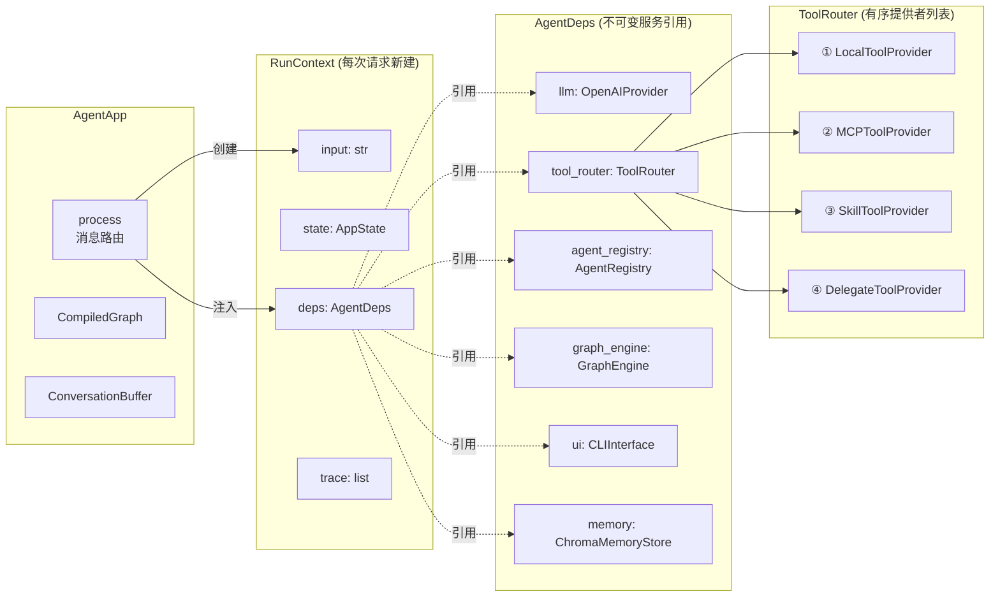
```mermaid
graph LR
    subgraph "AgentApp"
        direction TB
        APP_PROC[process<br/>消息路由]
        APP_GRAPH[CompiledGraph]
        APP_BUF[ConversationBuffer]
    end

    subgraph "AgentDeps (不可变服务引用)"
        direction TB
        D_LLM[llm: OpenAIProvider]
        D_TR[tool_router: ToolRouter]
        D_REG[agent_registry: AgentRegistry]
        D_GE[graph_engine: GraphEngine]
        D_UI[ui: CLIInterface]
        D_MEM[memory: ChromaMemoryStore]
    end

    subgraph "RunContext (每次请求新建)"
        direction TB
        RC_INPUT[input: str]
        RC_STATE[state: AppState]
        RC_DEPS[deps: AgentDeps]
        RC_TRACE[trace: list]
    end

    APP_PROC -->|创建| RC_INPUT
    APP_PROC -->|注入| RC_DEPS
    RC_DEPS -.->|引用| D_LLM
    RC_DEPS -.->|引用| D_TR
    RC_DEPS -.->|引用| D_REG
    RC_DEPS -.->|引用| D_GE
    RC_DEPS -.->|引用| D_UI
    RC_DEPS -.->|引用| D_MEM

    subgraph "ToolRouter (有序提供者列表)"
        direction TB
        P1["① LocalToolProvider"]
        P2["② MCPToolProvider"]
        P3["③ SkillToolProvider"]
        P4["④ DelegateToolProvider"]
    end

    D_TR --> P1
    D_TR --> P2
    D_TR --> P3
    D_TR --> P4
```

### 3.3 AppState 共享黑板

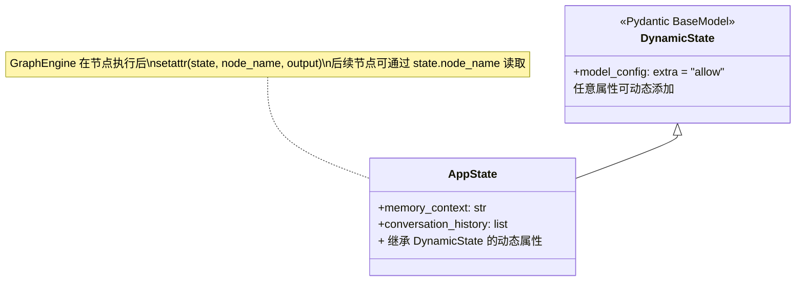
```mermaid
classDiagram
    class DynamicState {
        <<Pydantic BaseModel>>
        +model_config: extra = "allow"
        任意属性可动态添加
    }

    class AppState {
        +memory_context: str
        +conversation_history: list
        + 继承 DynamicState 的动态属性
    }

    DynamicState <|-- AppState

    note for AppState "GraphEngine 在节点执行后\nsetattr(state, node_name, output)\n后续节点可通过 state.node_name 读取"
```

---

## 4. 请求处理主流程

### 4.1 消息路由总览

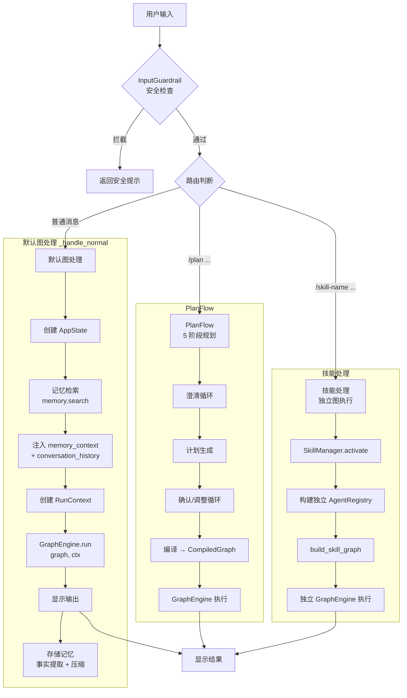
```mermaid
flowchart TD
    INPUT[用户输入] --> GUARD{InputGuardrail<br/>安全检查}
    GUARD -->|拦截| BLOCK[返回安全提示]
    GUARD -->|通过| ROUTE{路由判断}

    ROUTE -->|"/plan ..."| PLAN[PlanFlow<br/>5 阶段规划]
    ROUTE -->|"/skill-name ..."| SKILL[技能处理<br/>独立图执行]
    ROUTE -->|普通消息| NORMAL[默认图处理]

    subgraph "PlanFlow"
        PLAN --> P1[澄清循环]
        P1 --> P2[计划生成]
        P2 --> P3[确认/调整循环]
        P3 --> P4[编译 → CompiledGraph]
        P4 --> P5[GraphEngine 执行]
    end

    subgraph "技能处理"
        SKILL --> S1[SkillManager.activate]
        S1 --> S2[构建独立 AgentRegistry]
        S2 --> S3[build_skill_graph]
        S3 --> S4[独立 GraphEngine 执行]
    end

    subgraph "默认图处理 _handle_normal"
        NORMAL --> N1[创建 AppState]
        N1 --> N2[记忆检索<br/>memory.search]
        N2 --> N3[注入 memory_context<br/>+ conversation_history]
        N3 --> N4[创建 RunContext]
        N4 --> N5[GraphEngine.run<br/>graph, ctx]
        N5 --> N6[显示输出]
        N6 --> N7[存储记忆<br/>事实提取 + 压缩]
    end

    P5 --> DISPLAY[显示结果]
    S4 --> DISPLAY
    N6 --> DISPLAY
```

### 4.2 普通消息处理详细序列图

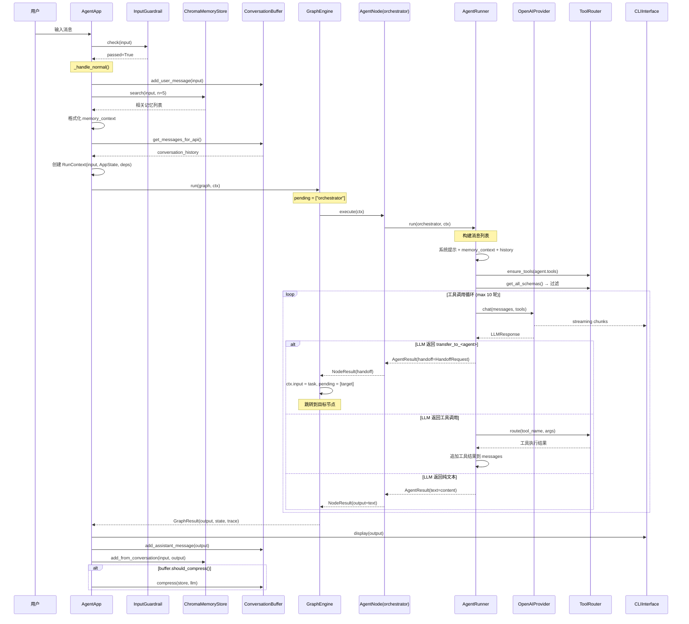
```mermaid
sequenceDiagram
    participant U as 用户
    participant APP as AgentApp
    participant GUARD as InputGuardrail
    participant MEM as ChromaMemoryStore
    participant BUF as ConversationBuffer
    participant GE as GraphEngine
    participant AN as AgentNode(orchestrator)
    participant RUN as AgentRunner
    participant LLM as OpenAIProvider
    participant TR as ToolRouter
    participant UI as CLIInterface

    U->>APP: 输入消息
    APP->>GUARD: check(input)
    GUARD-->>APP: passed=True

    Note over APP: _handle_normal()

    APP->>BUF: add_user_message(input)
    APP->>MEM: search(input, n=5)
    MEM-->>APP: 相关记忆列表
    APP->>APP: 格式化 memory_context
    APP->>BUF: get_messages_for_api()
    BUF-->>APP: conversation_history

    APP->>APP: 创建 RunContext(input, AppState, deps)
    APP->>GE: run(graph, ctx)

    Note over GE: pending = ["orchestrator"]

    GE->>AN: execute(ctx)
    AN->>RUN: run(orchestrator, ctx)

    Note over RUN: 构建消息列表

    RUN->>RUN: 系统提示 + memory_context + history
    RUN->>TR: ensure_tools(agent.tools)
    RUN->>TR: get_all_schemas() → 过滤

    loop 工具调用循环 (max 10 轮)
        RUN->>LLM: chat(messages, tools)
        LLM-->>UI: streaming chunks
        LLM-->>RUN: LLMResponse

        alt LLM 返回 transfer_to_<agent>
            RUN-->>AN: AgentResult(handoff=HandoffRequest)
            AN-->>GE: NodeResult(handoff)
            GE->>GE: ctx.input = task, pending = [target]
            Note over GE: 跳转到目标节点
        else LLM 返回工具调用
            RUN->>TR: route(tool_name, args)
            TR-->>RUN: 工具执行结果
            RUN->>RUN: 追加工具结果到 messages
        else LLM 返回纯文本
            RUN-->>AN: AgentResult(text=content)
            AN-->>GE: NodeResult(output=text)
        end
    end

    GE-->>APP: GraphResult(output, state, trace)

    APP->>UI: display(output)
    APP->>BUF: add_assistant_message(output)
    APP->>MEM: add_from_conversation(input, output)

    alt buffer.should_compress()
        APP->>BUF: compress(store, llm)
    end
```

---

## 5. 图引擎执行流程

### 5.1 GraphEngine 核心算法

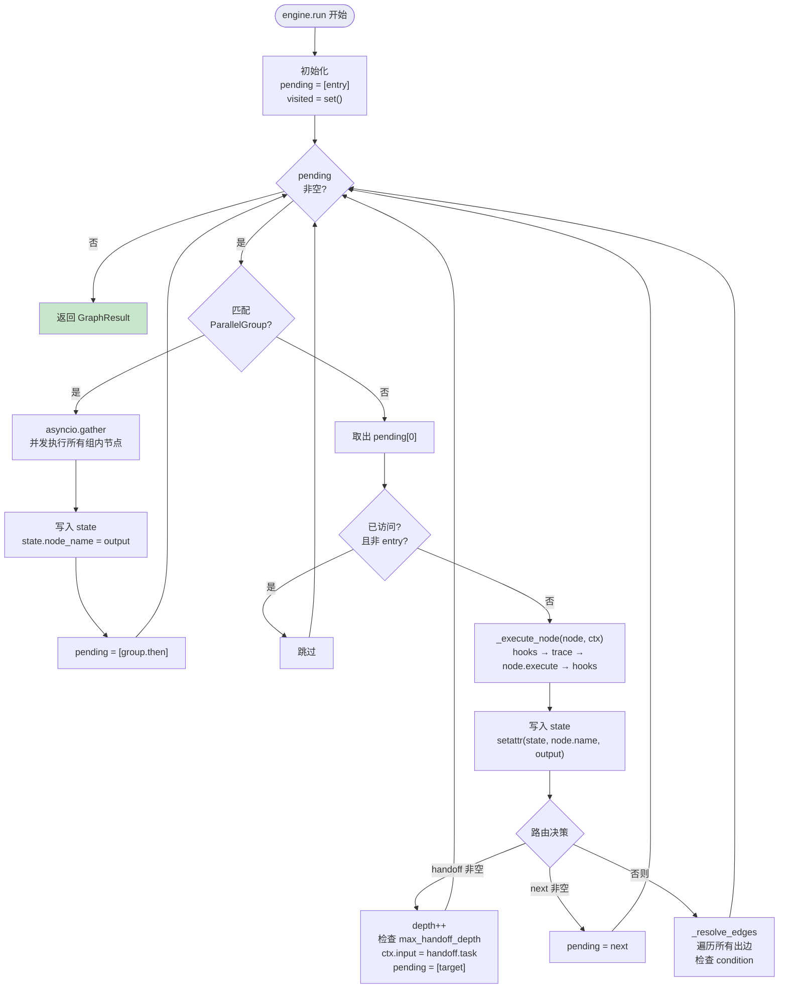
```mermaid
flowchart TD
    START([engine.run 开始]) --> INIT["初始化<br/>pending = [entry]<br/>visited = set()"]
    INIT --> CHECK{pending<br/>非空?}

    CHECK -->|否| RETURN[返回 GraphResult]
    CHECK -->|是| PARALLEL{匹配<br/>ParallelGroup?}

    PARALLEL -->|是| PAR_EXEC["asyncio.gather<br/>并发执行所有组内节点"]
    PAR_EXEC --> PAR_STATE["写入 state<br/>state.node_name = output"]
    PAR_STATE --> PAR_NEXT["pending = [group.then]"]
    PAR_NEXT --> CHECK

    PARALLEL -->|否| POP["取出 pending[0]"]
    POP --> VISITED{已访问?<br/>且非 entry?}
    VISITED -->|是| SKIP[跳过] --> CHECK
    VISITED -->|否| EXEC["_execute_node(node, ctx)<br/>hooks → trace → node.execute → hooks"]
    EXEC --> STATE["写入 state<br/>setattr(state, node.name, output)"]

    STATE --> ROUTE{路由决策}
    ROUTE -->|handoff 非空| HANDOFF["depth++<br/>检查 max_handoff_depth<br/>ctx.input = handoff.task<br/>pending = [target]"]
    ROUTE -->|next 非空| NEXT["pending = next"]
    ROUTE -->|否则| EDGES["_resolve_edges<br/>遍历所有出边<br/>检查 condition"]

    HANDOFF --> CHECK
    NEXT --> CHECK
    EDGES --> CHECK

    style START fill:#e8eaf6
    style RETURN fill:#c8e6c9
```

### 5.2 图拓扑（默认图）

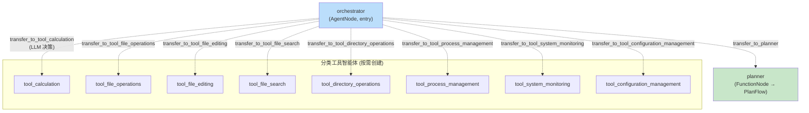
```mermaid
graph TD
    ORCH["orchestrator<br/>(AgentNode, entry)"]

    subgraph "分类工具智能体 (按需创建)"
        CALC[tool_calculation]
        FILE_OP[tool_file_operations]
        FILE_EDIT[tool_file_editing]
        FILE_SEARCH[tool_file_search]
        DIR_OP[tool_directory_operations]
        PROC[tool_process_management]
        SYS[tool_system_monitoring]
        CONFIG[tool_configuration_management]
    end

    PLANNER["planner<br/>(FunctionNode → PlanFlow)"]

    ORCH -.->|"transfer_to_tool_calculation<br/>(LLM 决策)"| CALC
    ORCH -.->|"transfer_to_tool_file_operations"| FILE_OP
    ORCH -.->|"transfer_to_tool_file_editing"| FILE_EDIT
    ORCH -.->|"transfer_to_tool_file_search"| FILE_SEARCH
    ORCH -.->|"transfer_to_tool_directory_operations"| DIR_OP
    ORCH -.->|"transfer_to_tool_process_management"| PROC
    ORCH -.->|"transfer_to_tool_system_monitoring"| SYS
    ORCH -.->|"transfer_to_tool_configuration_management"| CONFIG
    ORCH -.->|"transfer_to_planner"| PLANNER

    style ORCH fill:#bbdefb
    style PLANNER fill:#c8e6c9
```

> **注意**：图中没有静态 `Edge` 连接节点。所有路由完全由 orchestrator LLM 调用 `transfer_to_*` 工具实现。分类智能体在首次被引用时由 `AgentRegistry` + `CategoryResolver` 懒创建。

### 5.3 Handoff 机制详解

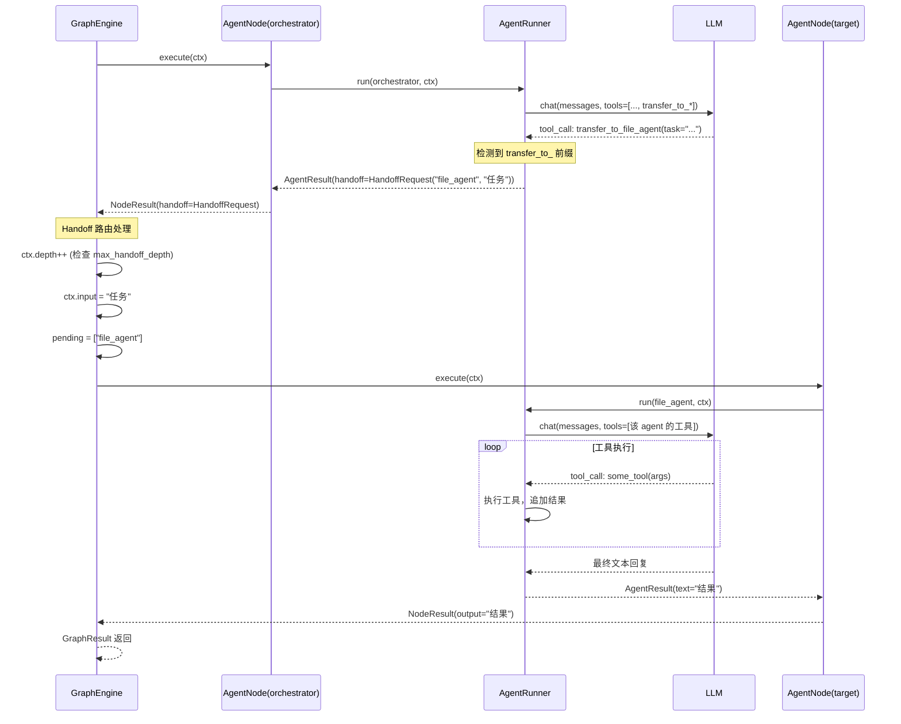
```mermaid
sequenceDiagram
    participant GE as GraphEngine
    participant ORCH as AgentNode(orchestrator)
    participant RUN as AgentRunner
    participant LLM as LLM
    participant TARGET as AgentNode(target)

    GE->>ORCH: execute(ctx)
    ORCH->>RUN: run(orchestrator, ctx)

    RUN->>LLM: chat(messages, tools=[..., transfer_to_*])
    LLM-->>RUN: tool_call: transfer_to_file_agent(task="...")

    Note over RUN: 检测到 transfer_to_ 前缀

    RUN-->>ORCH: AgentResult(handoff=HandoffRequest("file_agent", "任务"))
    ORCH-->>GE: NodeResult(handoff=HandoffRequest)

    Note over GE: Handoff 路由处理
    GE->>GE: ctx.depth++ (检查 max_handoff_depth)
    GE->>GE: ctx.input = "任务"
    GE->>GE: pending = ["file_agent"]

    GE->>TARGET: execute(ctx)
    TARGET->>RUN: run(file_agent, ctx)
    RUN->>LLM: chat(messages, tools=[该 agent 的工具])

    loop 工具执行
        LLM-->>RUN: tool_call: some_tool(args)
        RUN->>RUN: 执行工具，追加结果
    end

    LLM-->>RUN: 最终文本回复
    RUN-->>TARGET: AgentResult(text="结果")
    TARGET-->>GE: NodeResult(output="结果")
    GE-->>GE: GraphResult 返回
```

---

## 6. 智能体系统

### 6.1 Agent 数据模型

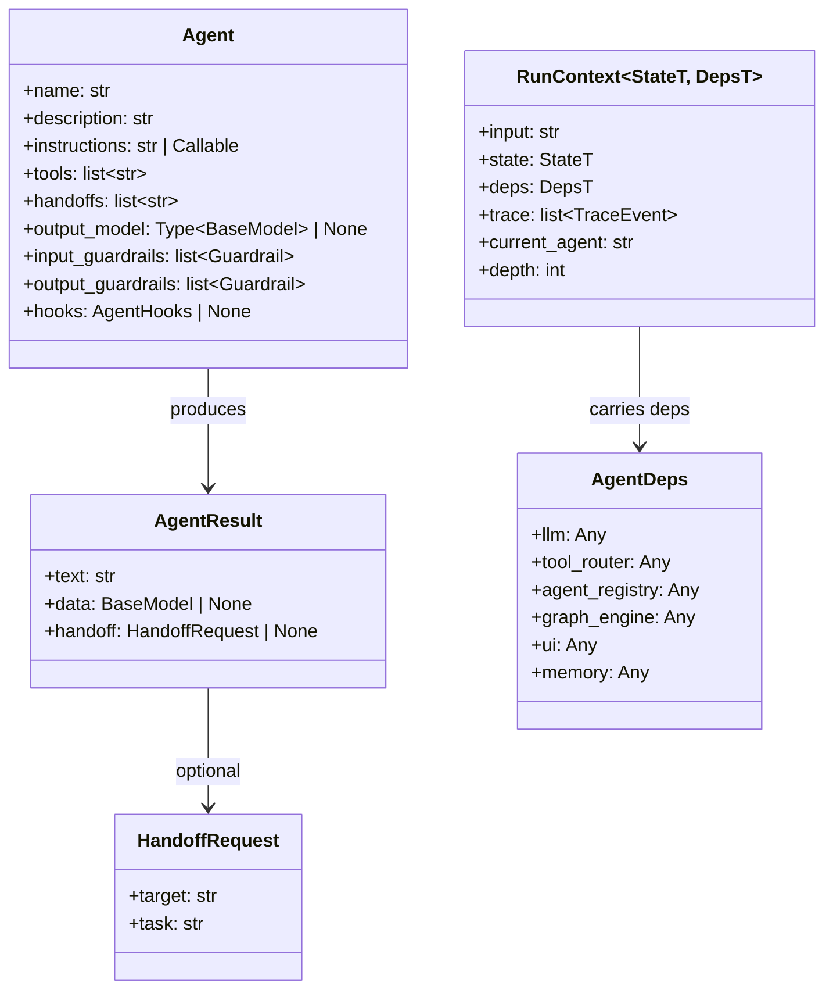
```mermaid
classDiagram
    class Agent {
        +name: str
        +description: str
        +instructions: str | Callable
        +tools: list~str~
        +handoffs: list~str~
        +output_model: Type~BaseModel~ | None
        +input_guardrails: list~Guardrail~
        +output_guardrails: list~Guardrail~
        +hooks: AgentHooks | None
    }

    class AgentResult {
        +text: str
        +data: BaseModel | None
        +handoff: HandoffRequest | None
    }

    class HandoffRequest {
        +target: str
        +task: str
    }

    class RunContext~StateT, DepsT~ {
        +input: str
        +state: StateT
        +deps: DepsT
        +trace: list~TraceEvent~
        +current_agent: str
        +depth: int
    }

    class AgentDeps {
        +llm: Any
        +tool_router: Any
        +agent_registry: Any
        +graph_engine: Any
        +ui: Any
        +memory: Any
    }

    Agent --> AgentResult : produces
    AgentResult --> HandoffRequest : optional
    RunContext --> AgentDeps : carries deps
```

### 6.2 AgentRunner 工具调用循环

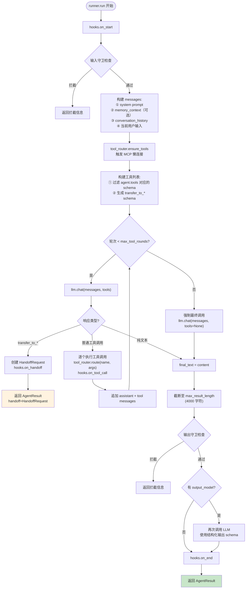
```mermaid
flowchart TD
    START([runner.run 开始]) --> HOOKS_START[hooks.on_start]
    HOOKS_START --> INPUT_GUARD{输入守卫检查}
    INPUT_GUARD -->|拦截| BLOCK_RETURN[返回拦截信息]
    INPUT_GUARD -->|通过| BUILD_MSG["构建 messages:<br/>① system prompt<br/>② memory_context（可选）<br/>③ conversation_history<br/>④ 当前用户输入"]

    BUILD_MSG --> ENSURE[tool_router.ensure_tools<br/>触发 MCP 懒连接]
    ENSURE --> BUILD_TOOLS["构建工具列表:<br/>① 过滤 agent.tools 对应的 schema<br/>② 生成 transfer_to_* schema"]

    BUILD_TOOLS --> LOOP{轮次 < max_tool_rounds?}
    LOOP -->|否| FORCE["强制最终调用<br/>llm.chat(messages, tools=None)"]
    LOOP -->|是| LLM_CALL["llm.chat(messages, tools)"]

    LLM_CALL --> CHECK_RESP{响应类型?}

    CHECK_RESP -->|"transfer_to_*"| HANDOFF["创建 HandoffRequest<br/>hooks.on_handoff"]
    CHECK_RESP -->|普通工具调用| TOOL_EXEC["逐个执行工具调用<br/>tool_router.route(name, args)<br/>hooks.on_tool_call"]
    CHECK_RESP -->|纯文本| FINAL_TEXT[final_text = content]

    HANDOFF --> RETURN_HANDOFF[返回 AgentResult<br/>handoff=HandoffRequest]

    TOOL_EXEC --> APPEND["追加 assistant + tool messages"]
    APPEND --> LOOP

    FORCE --> FINAL_TEXT

    FINAL_TEXT --> TRUNCATE["截断至 max_result_length<br/>(4000 字符)"]
    TRUNCATE --> OUTPUT_GUARD{输出守卫检查}
    OUTPUT_GUARD -->|拦截| OUTPUT_BLOCK[返回拦截信息]
    OUTPUT_GUARD -->|通过| STRUCT{有 output_model?}

    STRUCT -->|是| STRUCT_CALL["再次调用 LLM<br/>使用结构化输出 schema"]
    STRUCT -->|否| HOOKS_END[hooks.on_end]

    STRUCT_CALL --> HOOKS_END
    HOOKS_END --> RETURN[返回 AgentResult]

    style START fill:#e8eaf6
    style RETURN fill:#c8e6c9
    style RETURN_HANDOFF fill:#fff3e0
```

### 6.3 AgentRegistry 懒加载

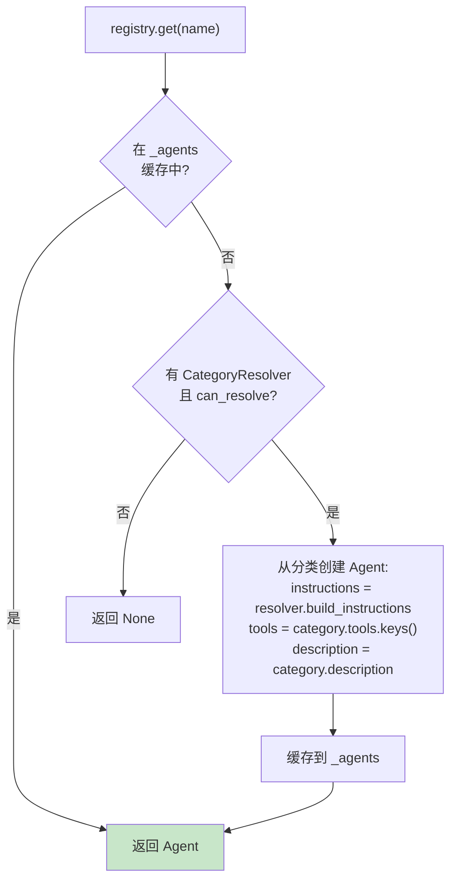
```mermaid
flowchart TD
    GET["registry.get(name)"] --> CACHE{在 _agents<br/>缓存中?}
    CACHE -->|是| RETURN[返回 Agent]
    CACHE -->|否| RESOLVER{有 CategoryResolver<br/>且 can_resolve?}
    RESOLVER -->|否| NONE[返回 None]
    RESOLVER -->|是| CREATE["从分类创建 Agent:<br/>instructions = resolver.build_instructions<br/>tools = category.tools.keys()<br/>description = category.description"]
    CREATE --> STORE["缓存到 _agents"]
    STORE --> RETURN

    style RETURN fill:#c8e6c9
```

---

## 7. 工具系统

### 7.1 工具注册与发现

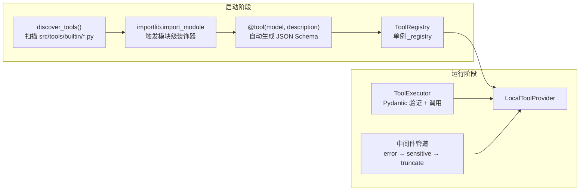
```mermaid
flowchart LR
    subgraph "启动阶段"
        DISCOVER["discover_tools()<br/>扫描 src/tools/builtin/*.py"]
        IMPORT["importlib.import_module<br/>触发模块级装饰器"]
        DECORATOR["@tool(model, description)<br/>自动生成 JSON Schema"]
        REGISTRY["ToolRegistry<br/>单例 _registry"]

        DISCOVER --> IMPORT --> DECORATOR --> REGISTRY
    end

    subgraph "运行阶段"
        EXECUTOR["ToolExecutor<br/>Pydantic 验证 + 调用"]
        PIPELINE["中间件管道<br/>error → sensitive → truncate"]
        LOCAL_P["LocalToolProvider"]

        REGISTRY --> LOCAL_P
        EXECUTOR --> LOCAL_P
        PIPELINE --> LOCAL_P
    end
```

### 7.2 ToolRouter 路由流程

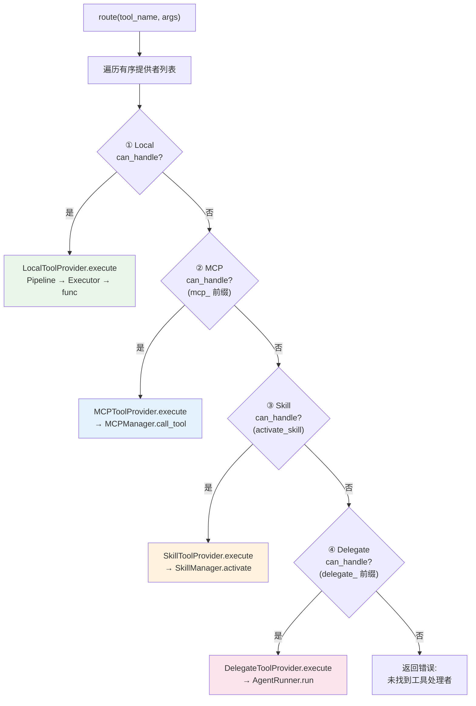
```mermaid
flowchart TD
    CALL["route(tool_name, args)"] --> ITER["遍历有序提供者列表"]

    ITER --> P1{"① Local<br/>can_handle?"}
    P1 -->|是| E1["LocalToolProvider.execute<br/>Pipeline → Executor → func"]
    P1 -->|否| P2{"② MCP<br/>can_handle?<br/>(mcp_ 前缀)"}

    P2 -->|是| E2["MCPToolProvider.execute<br/>→ MCPManager.call_tool"]
    P2 -->|否| P3{"③ Skill<br/>can_handle?<br/>(activate_skill)"}

    P3 -->|是| E3["SkillToolProvider.execute<br/>→ SkillManager.activate"]
    P3 -->|否| P4{"④ Delegate<br/>can_handle?<br/>(delegate_ 前缀)"}

    P4 -->|是| E4["DelegateToolProvider.execute<br/>→ AgentRunner.run"]
    P4 -->|否| ERR["返回错误:<br/>未找到工具处理者"]

    style E1 fill:#e8f5e9
    style E2 fill:#e3f2fd
    style E3 fill:#fff3e0
    style E4 fill:#fce4ec
```

### 7.3 中间件管道（洋葱模型）

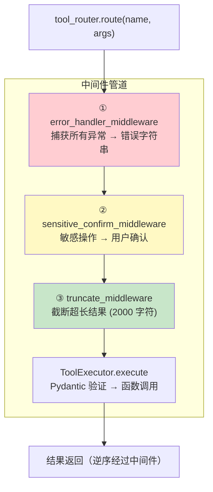
```mermaid
flowchart TD
    CALL["tool_router.route(name, args)"] --> MW1

    subgraph "中间件管道"
        direction TB
        MW1["① error_handler_middleware<br/>捕获所有异常 → 错误字符串"]
        MW2["② sensitive_confirm_middleware<br/>敏感操作 → 用户确认"]
        MW3["③ truncate_middleware<br/>截断超长结果 (2000 字符)"]
        EXEC["ToolExecutor.execute<br/>Pydantic 验证 → 函数调用"]

        MW1 --> MW2
        MW2 --> MW3
        MW3 --> EXEC
    end

    EXEC --> RESULT["结果返回（逆序经过中间件）"]

    style MW1 fill:#ffcdd2
    style MW2 fill:#fff9c4
    style MW3 fill:#c8e6c9
```

### 7.4 工具分类与委派

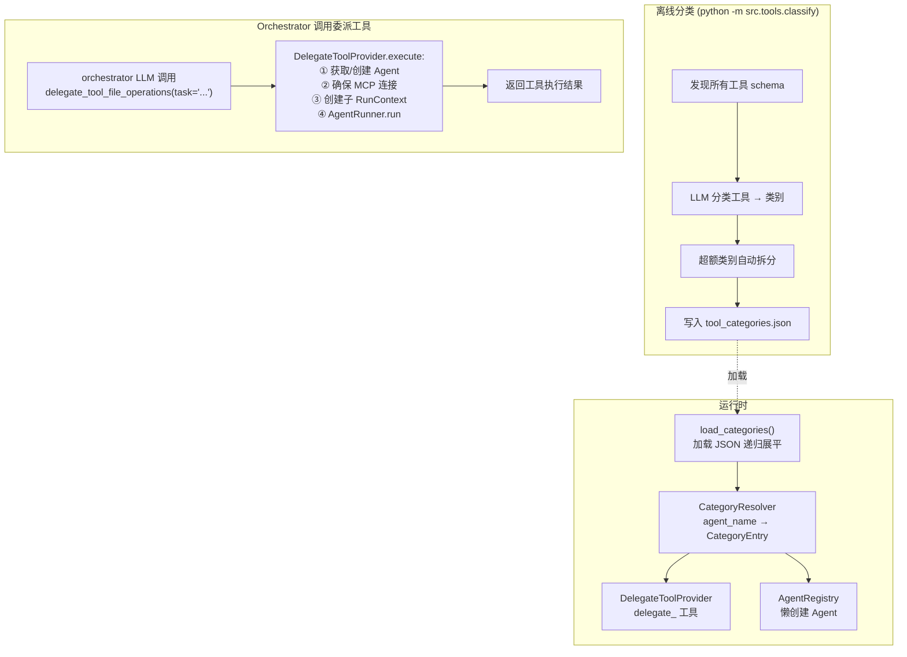
```mermaid
flowchart TD
    subgraph "离线分类 (python -m src.tools.classify)"
        CLS_DISCOVER["发现所有工具 schema"]
        CLS_LLM["LLM 分类工具 → 类别"]
        CLS_SPLIT["超额类别自动拆分"]
        CLS_WRITE["写入 tool_categories.json"]

        CLS_DISCOVER --> CLS_LLM --> CLS_SPLIT --> CLS_WRITE
    end

    subgraph "运行时"
        CAT_LOAD["load_categories()<br/>加载 JSON 递归展平"]
        CAT_RESOLVE["CategoryResolver<br/>agent_name → CategoryEntry"]
        DEL_PROV["DelegateToolProvider<br/>delegate_<agent> 工具"]
        AGENT_REG["AgentRegistry<br/>懒创建 Agent"]

        CAT_LOAD --> CAT_RESOLVE
        CAT_RESOLVE --> DEL_PROV
        CAT_RESOLVE --> AGENT_REG
    end

    subgraph "Orchestrator 调用委派工具"
        ORCH_LLM["orchestrator LLM 调用<br/>delegate_tool_file_operations(task='...')"]
        DEL_EXEC["DelegateToolProvider.execute:<br/>① 获取/创建 Agent<br/>② 确保 MCP 连接<br/>③ 创建子 RunContext<br/>④ AgentRunner.run"]
        RESULT["返回工具执行结果"]

        ORCH_LLM --> DEL_EXEC --> RESULT
    end

    CLS_WRITE -.->|"加载"| CAT_LOAD
```

### 7.5 Handoff vs Delegate 对比

| 维度 | Handoff (transfer_to_*) | Delegate (delegate_*) |
|------|------------------------|----------------------|
| 触发方式 | LLM 调用 `transfer_to_<agent>` 工具 | LLM 调用 `delegate_<agent>` 工具 |
| 路由层 | GraphEngine 层处理 | ToolRouter 层处理 |
| 上下文 | **共享** RunContext，切换 `ctx.input` | **独立** 子 RunContext |
| 返回 | 整个控制流转移到目标 Agent | 结果作为**工具结果**返回给调用方 |
| 用途 | 用于 orchestrator → 专家 agent 的协作 | 用于 orchestrator 需要工具结果继续推理 |

---

## 8. 记忆系统

### 8.1 记忆系统全景

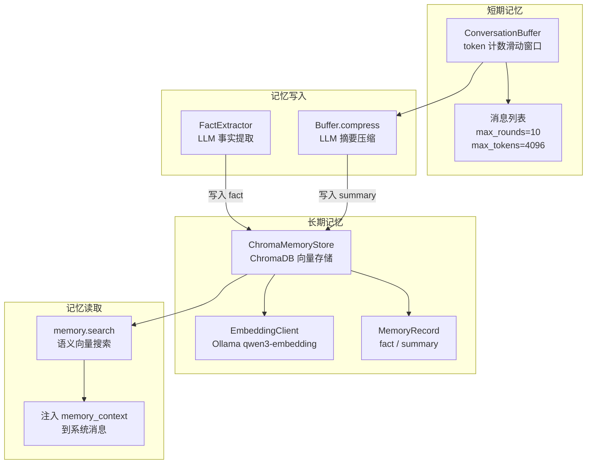
```mermaid
graph TD
    subgraph "短期记忆"
        BUF[ConversationBuffer<br/>token 计数滑动窗口]
        BUF_MSG["消息列表<br/>max_rounds=10<br/>max_tokens=4096"]
    end

    subgraph "长期记忆"
        CHROMA[ChromaMemoryStore<br/>ChromaDB 向量存储]
        EMBED[EmbeddingClient<br/>Ollama qwen3-embedding]
        RECORDS["MemoryRecord<br/>fact / summary"]
    end

    subgraph "记忆写入"
        EXTRACT[FactExtractor<br/>LLM 事实提取]
        COMPRESS["Buffer.compress<br/>LLM 摘要压缩"]
    end

    subgraph "记忆读取"
        SEARCH["memory.search<br/>语义向量搜索"]
        INJECT["注入 memory_context<br/>到系统消息"]
    end

    BUF --> BUF_MSG
    CHROMA --> EMBED
    CHROMA --> RECORDS

    EXTRACT -->|写入 fact| CHROMA
    COMPRESS -->|写入 summary| CHROMA

    CHROMA --> SEARCH
    BUF --> COMPRESS
    SEARCH --> INJECT
```

### 8.2 记忆读写流程

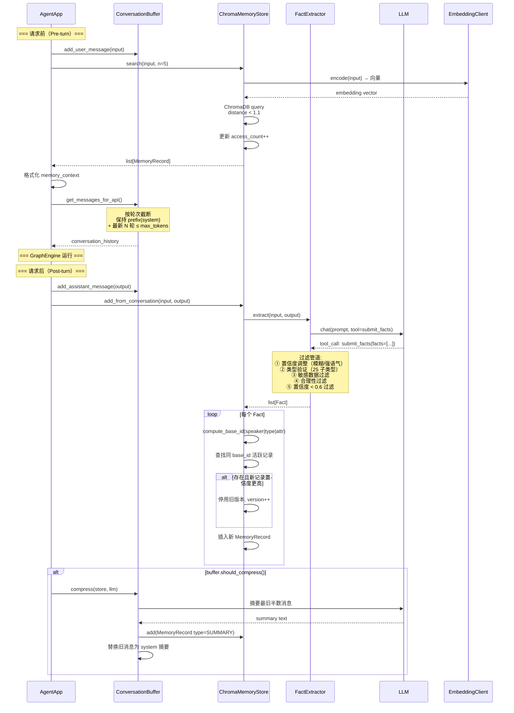
```mermaid
sequenceDiagram
    participant APP as AgentApp
    participant BUF as ConversationBuffer
    participant MEM as ChromaMemoryStore
    participant EXT as FactExtractor
    participant LLM as LLM
    participant EMBED as EmbeddingClient

    Note over APP: === 请求前（Pre-turn）===

    APP->>BUF: add_user_message(input)
    APP->>MEM: search(input, n=5)
    MEM->>EMBED: encode(input) → 向量
    EMBED-->>MEM: embedding vector
    MEM->>MEM: ChromaDB query<br/>distance < 1.1
    MEM->>MEM: 更新 access_count++
    MEM-->>APP: list[MemoryRecord]
    APP->>APP: 格式化 memory_context

    APP->>BUF: get_messages_for_api()
    Note over BUF: 按轮次截断<br/>保持 prefix(system)<br/>+ 最新 N 轮 ≤ max_tokens
    BUF-->>APP: conversation_history

    Note over APP: === GraphEngine 运行 ===

    Note over APP: === 请求后（Post-turn）===

    APP->>BUF: add_assistant_message(output)
    APP->>MEM: add_from_conversation(input, output)
    MEM->>EXT: extract(input, output)
    EXT->>LLM: chat(prompt, tool=submit_facts)
    LLM-->>EXT: tool_call: submit_facts(facts=[...])

    Note over EXT: 过滤管道:<br/>① 置信度调整（模糊/强语气）<br/>② 类型验证（25 子类型）<br/>③ 敏感数据过滤<br/>④ 合理性过滤<br/>⑤ 置信度 < 0.6 过滤

    EXT-->>MEM: list[Fact]

    loop 每个 Fact
        MEM->>MEM: compute_base_id(speaker|type|attr)
        MEM->>MEM: 查找同 base_id 活跃记录
        alt 存在且新记录置信度更高
            MEM->>MEM: 停用旧版本, version++
        end
        MEM->>MEM: 插入新 MemoryRecord
    end

    alt buffer.should_compress()
        APP->>BUF: compress(store, llm)
        BUF->>LLM: 摘要最旧半数消息
        LLM-->>BUF: summary text
        BUF->>MEM: add(MemoryRecord type=SUMMARY)
        BUF->>BUF: 替换旧消息为 system 摘要
    end
```

### 8.3 记忆衰减公式

```
importance = confidence × recency_weight × frequency_weight

recency_weight = exp(-0.01 × days_since_last_access)
                 ≈ 半衰期 70 天

frequency_weight = min(1.0, log(access_count + 1) / log(20))
                   在 20 次访问时达到 1.0

特例：SUMMARY 类型始终返回 1.0
```

```mermaid
graph LR
    CLEANUP["定期 cleanup()"] --> RECALC["recalculate_importance()<br/>遍历所有活跃记录"]
    RECALC --> FORMULA["计算 importance =<br/>confidence × recency × frequency"]
    FORMULA --> CHECK{importance < min_threshold?}
    CHECK -->|是| DEACTIVATE["停用记录<br/>is_active = False"]
    CHECK -->|否| UPDATE["更新 importance 值"]
```

### 8.4 MemoryRecord 版本控制

```mermaid
flowchart TD
    NEW["新事实: user.preference.language = Python"] --> HASH["compute_base_id<br/>SHA256(user|preference|language)"]
    HASH --> LOOKUP["查找 base_id = xxx<br/>is_active = True"]

    LOOKUP --> FOUND{找到旧记录?}
    FOUND -->|否| INSERT["直接插入<br/>version = 1"]
    FOUND -->|是| COMPARE{新 confidence<br/>> 旧 confidence?}
    COMPARE -->|否| SKIP["跳过（保留旧记录）"]
    COMPARE -->|是| DEACTIVATE["旧记录 is_active = False"]
    DEACTIVATE --> INSERT_NEW["插入新记录<br/>version = old.version + 1"]
```

---

## 9. 规划系统

### 9.1 PlanFlow 五阶段流程

```mermaid
flowchart TD
    START([用户输入: /plan 任务]) --> PHASE1

    subgraph PHASE1 ["阶段 1: 澄清循环 (最多 3 轮)"]
        CL_CHECK["check_clarification_needed<br/>(input, gathered_info, llm)"]
        CL_NEED{需要更多信息?}
        CL_ASK["向用户提问"]
        CL_RECV["收集用户回答<br/>更新 gathered_info"]
        CL_READY["信息充足 (READY)"]

        CL_CHECK --> CL_NEED
        CL_NEED -->|是| CL_ASK --> CL_RECV --> CL_CHECK
        CL_NEED -->|否| CL_READY
    end

    CL_READY --> PHASE2

    subgraph PHASE2 ["阶段 2: 计划生成"]
        GEN["generate_plan<br/>(input, tools, agents, context, llm)"]
        GEN_CHECK{LLM 调用了<br/>submit_plan?}
        GEN_SIMPLE["简单问题<br/>直接返回文本"]
        GEN_PLAN["解析 Plan 对象"]

        GEN --> GEN_CHECK
        GEN_CHECK -->|否| GEN_SIMPLE
        GEN_CHECK -->|是| GEN_PLAN
    end

    GEN_PLAN --> PHASE3

    subgraph PHASE3 ["阶段 3: 确认/调整循环 (最多 3 轮)"]
        SHOW["展示格式化计划"]
        FB["获取用户反馈"]
        FB_CLS["classify_user_feedback<br/>→ confirm / adjust"]
        FB_ADJ["adjust_plan(feedback)"]

        SHOW --> FB --> FB_CLS
        FB_CLS -->|confirm| CONFIRMED
        FB_CLS -->|adjust| FB_ADJ --> SHOW
        CONFIRMED["用户确认"]
    end

    CONFIRMED --> PHASE4

    subgraph PHASE4 ["阶段 4: 编译"]
        COMPILE["PlanCompiler.compile(plan)"]
        TOPO["拓扑排序 → 层级列表"]
        NODES["生成 FunctionNode 闭包"]
        WIRE["连接边 / 并行组"]
        CG["输出 CompiledGraph"]

        COMPILE --> TOPO --> NODES --> WIRE --> CG
    end

    CG --> PHASE5

    subgraph PHASE5 ["阶段 5: 执行"]
        RUN["GraphEngine.run(compiled_graph, ctx)"]
        RESULT["返回执行结果"]

        RUN --> RESULT
    end

    style PHASE1 fill:#e3f2fd
    style PHASE2 fill:#e8f5e9
    style PHASE3 fill:#fff3e0
    style PHASE4 fill:#f3e5f5
    style PHASE5 fill:#fce4ec
```

### 9.2 PlanCompiler 编译流程

```mermaid
flowchart TD
    PLAN["Plan<br/>steps 列表"] --> VALIDATE["验证:<br/>① 非空<br/>② step ID 唯一<br/>③ 引用的 agent 存在"]
    VALIDATE --> TOPO["拓扑排序 (BFS 按入度)<br/>→ list[list[Step]]<br/>每层内无依赖关系"]

    TOPO --> LAYERS["遍历层级"]

    LAYERS --> SINGLE{单步骤层?}

    SINGLE -->|是| FUNC_NODE["创建 FunctionNode<br/>闭包捕获 step 信息"]
    SINGLE -->|否| PAR_GROUP["创建 ParallelGroup<br/>+ 合成 _merge_N 空节点"]

    FUNC_NODE --> EDGE["添加 Edge 到下一层"]
    PAR_GROUP --> EDGE

    EDGE --> DONE{所有层<br/>处理完?}
    DONE -->|否| LAYERS
    DONE -->|是| COMPILE_OUT["compile() → CompiledGraph"]

    subgraph "FunctionNode 闭包内部"
        RESOLVE["resolve_variables<br/>替换 $step_id.field"]
        RESOLVE --> STEP_TYPE{step 类型?}
        STEP_TYPE -->|tool| TOOL_CALL["tool_router.route<br/>(tool_name, resolved_args)"]
        STEP_TYPE -->|agent| AGENT_CALL["AgentRunner.run<br/>(agent, sub_ctx)"]
    end
```

### 9.3 计划编译示例

```yaml
# 原始计划
steps:
  - id: search
    tool_name: file_search
    tool_args: { query: "config" }
  - id: read
    tool_name: read_file
    tool_args: { path: "$search.result" }
    depends_on: [search]
  - id: analyze
    agent_name: code_analyzer
    agent_prompt: "分析 $read.content"
    depends_on: [read]
```

编译后的图：

```mermaid
graph LR
    SEARCH["search<br/>(FunctionNode)"] -->|Edge| READ["read<br/>(FunctionNode)"]
    READ -->|Edge| ANALYZE["analyze<br/>(FunctionNode)"]

    style SEARCH fill:#e3f2fd
    style READ fill:#e8f5e9
    style ANALYZE fill:#fff3e0
```

如果 `read` 和 `analyze` 无依赖关系，则：

```mermaid
graph LR
    SEARCH["search<br/>(FunctionNode)"]
    READ["read<br/>(FunctionNode)"]
    ANALYZE["analyze<br/>(FunctionNode)"]
    MERGE["_merge_1<br/>(空合并节点)"]

    SEARCH -->|Edge| READ
    SEARCH -->|Edge| ANALYZE
    READ -->|ParallelGroup| MERGE
    ANALYZE -->|ParallelGroup| MERGE

    style MERGE fill:#f5f5f5
```

---

## 10. MCP 集成

### 10.1 MCP 懒连接架构

```mermaid
flowchart TD
    subgraph "启动阶段 (零连接)"
        LOAD_CFG["load_mcp_config()<br/>读取 mcp_servers.json"]
        MGR["MCPManager<br/>存储配置，不连接"]
        PROV["MCPToolProvider<br/>添加到 ToolRouter"]

        LOAD_CFG --> MGR --> PROV
    end

    subgraph "运行时 (按需连接)"
        TRIGGER["触发点:<br/>① AgentRunner.ensure_tools<br/>② DelegateToolProvider.execute"]
        ENSURE["ensure_servers_for_tools<br/>(tool_names)"]
        MATCH["最长前缀匹配<br/>mcp_server_tool → server"]
        CONNECT["connect_server(safe_name)<br/>幂等 + 双重检查锁"]

        TRIGGER --> ENSURE --> MATCH --> CONNECT
    end

    subgraph "连接流程"
        LOCK["获取 per-server Lock"]
        CHECK{已连接?}
        TRANSPORT{传输类型?}
        STDIO["StdioServerParameters<br/>→ stdio_client<br/>→ ClientSession"]
        HTTP["streamablehttp_client<br/>→ ClientSession"]
        INIT["session.initialize()"]
        DISCOVER["list_tools (分页)<br/>→ 注册 mcp_{server}_{tool}"]

        LOCK --> CHECK
        CHECK -->|是| SKIP[跳过]
        CHECK -->|否| TRANSPORT
        TRANSPORT -->|stdio| STDIO --> INIT
        TRANSPORT -->|http| HTTP --> INIT
        INIT --> DISCOVER
    end

    CONNECT --> LOCK
```

### 10.2 MCP 工具调用流程

```mermaid
sequenceDiagram
    participant RUN as AgentRunner
    participant TR as ToolRouter
    participant MCP_P as MCPToolProvider
    participant MGR as MCPManager
    participant SESSION as MCP ClientSession
    participant SERVER as MCP Server 进程

    RUN->>TR: route("mcp_desktop_commander_read_file", args)
    TR->>MCP_P: can_handle? → True (mcp_ 前缀)
    TR->>MCP_P: execute(tool_name, args)
    MCP_P->>MGR: call_tool(tool_name, args)

    Note over MGR: 查找 _tool_map<br/>"mcp_desktop_commander_read_file"<br/>→ (server="desktop_commander", tool="read_file")

    MGR->>SESSION: call_tool("read_file", args, timeout=30)
    SESSION->>SERVER: JSON-RPC 请求
    SERVER-->>SESSION: CallToolResult
    SESSION-->>MGR: result

    Note over MGR: 转换结果:<br/>TextContent → str<br/>其他 → "[binary N bytes]"

    MGR-->>MCP_P: result string
    MCP_P-->>TR: result
    TR-->>RUN: result
```

### 10.3 MCP 配置结构

```json
{
  "mcpServers": {
    "desktop-commander": {
      "transport": "stdio",
      "command": "npx",
      "args": ["-y", "@anthropic/desktop-commander"],
      "timeout": 30
    }
  },
  "roots": ["/path/to/project"]
}
```

工具命名规则：`mcp_{safe_server_name}_{safe_tool_name}`
- `safe_name`: 非字母数字字符替换为 `_`
- 例：`desktop-commander` → `desktop_commander`，工具 `read_file` → `mcp_desktop_commander_read_file`

---

## 11. 技能系统

### 11.1 技能发现与激活

```mermaid
flowchart TD
    subgraph "启动阶段"
        SCAN["SkillManager.discover()<br/>扫描 skills/ 和 .agents/skills/"]
        PARSE["解析 SKILL.md<br/>YAML frontmatter + body"]
        CATALOG["build_activate_tool_schema<br/>生成 activate_skill 工具"]

        SCAN --> PARSE --> CATALOG
    end

    subgraph "SKILL.md 格式"
        FORMAT["---<br/>name: code-review<br/>description: 多维度代码审查<br/>---<br/><br/>技能内容（Markdown）..."]
    end

    PARSE -.->|读取| FORMAT

    subgraph "运行时激活"
        INPUT["/code-review 代码审查请求"]
        IS_SKILL{匹配已知技能?}

        IS_SKILL -->|否| NORMAL[普通消息处理]
        IS_SKILL -->|是| ACTIVATE["SkillManager.activate(name)"]
        ACTIVATE --> CONTENT["返回 XML 包装内容:<br/>&lt;skill_content&gt;<br/>body + 目录 + 资源<br/>&lt;/skill_content&gt;"]
        CONTENT --> ISO_BUILD["构建独立图:<br/>① 新 AgentRegistry<br/>② 新 AgentRunner<br/>③ build_skill_graph<br/>④ 新 GraphEngine"]
        ISO_BUILD --> ISO_RUN["独立执行"]
    end
```

### 11.2 技能隔离执行

```mermaid
sequenceDiagram
    participant APP as AgentApp
    participant SM as SkillManager
    participant PRESET as presets.py
    participant GE2 as 独立 GraphEngine
    participant ORCH2 as 独立 orchestrator
    participant UI as CLIInterface

    APP->>SM: activate("code-review")
    SM-->>APP: skill_content (XML)

    Note over APP: 构建完全独立的执行环境

    APP->>APP: 创建新 AgentRegistry
    APP->>APP: 创建新 AgentRunner
    APP->>PRESET: build_skill_graph(registry, skill_content, ...)

    Note over PRESET: orchestrator 指令 =<br/>skill_content + 标准指令

    PRESET-->>APP: 独立 CompiledGraph
    APP->>APP: 创建新 GraphEngine

    APP->>GE2: run(graph, fresh_ctx)
    GE2->>ORCH2: execute(ctx)

    Note over ORCH2: 系统提示包含技能指令<br/>根据技能内容执行任务

    ORCH2-->>GE2: result
    GE2-->>APP: GraphResult

    APP->>UI: display(result)
```

---

## 12. 守卫系统

### 12.1 输入守卫

```mermaid
flowchart TD
    INPUT[用户输入] --> PATTERNS["正则匹配检查:"]

    PATTERNS --> P1["忽略.*指令<br/>忽略.*系统提示"]
    PATTERNS --> P2["删除.*文件<br/>rm\\s+-rf"]
    PATTERNS --> P3["DROP\\s+TABLE"]
    PATTERNS --> P4["eval\\s*\\(<br/>exec\\s*\\("]

    P1 --> MATCH{任一匹配?}
    P2 --> MATCH
    P3 --> MATCH
    P4 --> MATCH

    MATCH -->|是| BLOCK["返回 (False, 原因)<br/>AgentApp 显示安全提示"]
    MATCH -->|否| PASS["返回 (True, '')<br/>继续处理"]
```

### 12.2 输出守卫

```mermaid
flowchart TD
    OUTPUT[LLM 输出] --> STRINGS["子串检查:"]
    STRINGS --> S1["'rm -rf'"]
    STRINGS --> S2["'DROP TABLE'"]
    STRINGS --> S3["'eval('"]

    S1 --> CHECK{任一包含?}
    S2 --> CHECK
    S3 --> CHECK

    CHECK -->|是| BLOCKED["GuardrailResult<br/>passed=False<br/>action='block'"]
    CHECK -->|否| PASSED["GuardrailResult<br/>passed=True"]
```

---

## 附录

### A. 文件导航速查

| 模块 | 关键文件 | 职责 |
|------|---------|------|
| 入口 | `main.py` | 启动应用 |
| 组装 | `src/app/bootstrap.py` | 唯一组件实例化点 |
| 应用 | `src/app/app.py` | REPL + 消息路由 |
| 预设 | `src/app/presets.py` | 构建默认/技能图 |
| 图引擎 | `src/graph/engine.py` | 异步图遍历 |
| 图构建 | `src/graph/builder.py` | 图 DSL |
| 图类型 | `src/graph/types.py` | NodeResult, Edge, ParallelGroup |
| Agent 模型 | `src/agents/agent.py` | Agent 数据类 |
| Agent 运行 | `src/agents/runner.py` | 工具调用循环 |
| Agent 注册 | `src/agents/registry.py` | 懒加载注册表 |
| Agent 节点 | `src/agents/node.py` | Agent → GraphNode 适配 |
| LLM 接口 | `src/llm/base.py` | LLMProvider Protocol |
| LLM 实现 | `src/llm/openai.py` | OpenAI 兼容实现 |
| 工具路由 | `src/tools/router.py` | ToolProvider + ToolRouter |
| 工具装饰器 | `src/tools/decorator.py` | @tool 注册机制 |
| 工具中间件 | `src/tools/middleware.py` | 洋葱模型管道 |
| 工具分类 | `src/tools/categories.py` | CategoryResolver |
| 工具委派 | `src/tools/delegate.py` | DelegateToolProvider |
| MCP 管理 | `src/mcp/manager.py` | 懒连接 + 工具发现 |
| MCP 适配 | `src/mcp/provider.py` | MCPToolProvider |
| 记忆存储 | `src/memory/chroma/store.py` | ChromaDB 实现 |
| 事实提取 | `src/memory/extractor.py` | LLM 驱动提取 |
| 对话缓冲 | `src/memory/buffer.py` | 滑动窗口 + 压缩 |
| 衰减计算 | `src/memory/decay.py` | 重要性衰减公式 |
| 计划流程 | `src/plan/flow.py` | 5 阶段编排 |
| 计划编译 | `src/plan/compiler.py` | Plan → CompiledGraph |
| 技能管理 | `src/skills/manager.py` | 发现 + 激活 |
| 配置 | `src/config.py` | YAML + .env 加载 |
| 守卫 | `src/guardrails/input.py` | 输入安全检查 |

### B. 数据流向总结

```
用户输入
  → InputGuardrail (安全检查)
  → AgentApp.process (路由)
  → ConversationBuffer (短期记忆)
  → ChromaMemoryStore.search (记忆检索)
  → RunContext 创建 (input + state + deps)
  → GraphEngine.run (图遍历)
    → AgentNode(orchestrator).execute
      → AgentRunner.run (工具循环)
        → LLM.chat (推理)
        → ToolRouter.route (工具执行)
          或 transfer_to_* (handoff)
    → [handoff] → AgentNode(target).execute → ...
  → GraphResult
  → UI.display (显示结果)
  → FactExtractor.extract (事实提取)
  → ChromaMemoryStore.add (记忆写入)
  → ConversationBuffer.compress (可选压缩)
```

### C. 关键设计决策

1. **LLM 驱动路由而非静态边**：orchestrator 到专家 agent 的路由完全由 LLM 决策，通过 `transfer_to_*` 工具实现，无需维护复杂的条件路由逻辑
2. **懒加载一切**：MCP 连接、分类 agent、工具 schema 均延迟到首次使用，启动快速
3. **共享黑板状态**：`DynamicState(extra="allow")` 让节点间通信零配置
4. **Planner 是 FunctionNode**：规划器绕过 AgentRunner，直接调用 PlanFlow，因其需要多轮用户交互
5. **技能完全隔离**：每次技能激活创建全新的 Registry/Runner/Engine，避免状态泄漏
6. **中间件洋葱模型**：工具执行的横切关注点（错误处理、用户确认、截断）通过可组合的中间件实现
7. **版本化记忆**：同一事实的更新通过 `base_id` + `version` 追踪，旧版本停用而非删除
