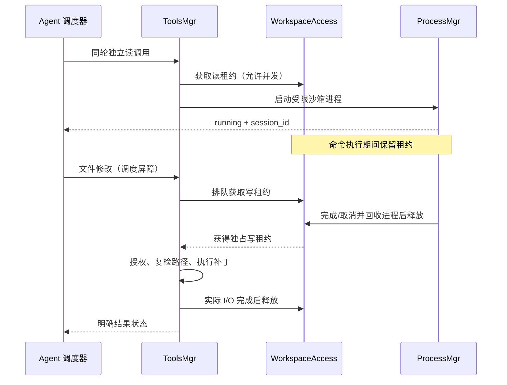
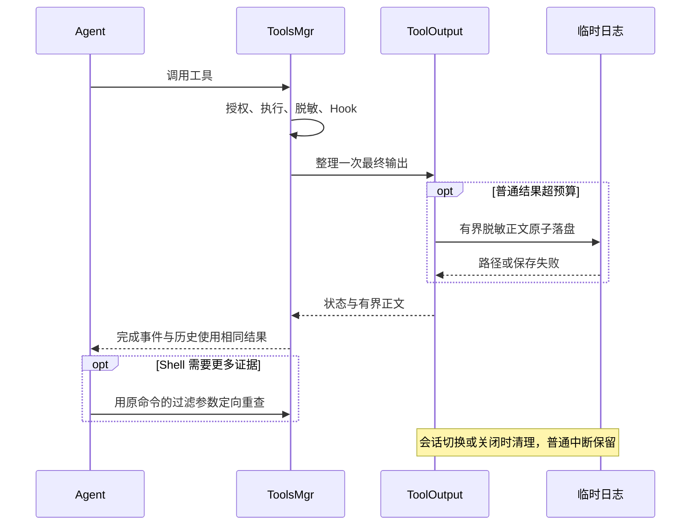

# 工具层参考

工具在 `src/tools/builtin/` 用 `@tool` + Pydantic 声明，由 `ToolsMgr` 注册和执行。装饰器保留 `policy`、`availability`、`counts_as_work`；`ToolAvailability` 集中描述可用模式、所需 feature 和调用方范围，`parallel=True` 仅用于可并发的独立读取。同步工具卸载到线程，取消时等待实际 I/O 结束后才释放工作区租约。

## 调用与结果

调用链：参数对象/未知字段校验 → PreToolUse → 重验参数 → `PermissionManager.authorize(ToolAuthorizationRequest)`（模式、feature、调用方范围、manifest、路径与风险）→ 工具执行 → DataGuard 脱敏 → PostToolUse → 脱敏与单次预算 → ToolCallCompleted → 历史消息。MCP 参数按上游 schema 校验。未知工具、非法 JSON、授权失败、执行错误均返回明确状态；调用方不能从正文前缀推断失败。

`exec_command` 与正常的 `write_stdin` 使用纯文本响应：`Chunk ID`、耗时、退出码或运行中 session、原始近似 token 数和命令原始输出。非零退出码仍是命令的真实完成结果。沙箱、启动、超时、取消等框架错误以及其他工具使用 JSON 元数据行加正文，模型无需从外部程序正文猜测框架状态。`display` 只供 UI 消费；`end_turn` 控制调度器结束回合。

所有模式、主 agent 和子 agent 都接收 `ToolsMgr.schemas()` 返回的同一份完整 schema 目录；模式切换不重建 schema。执行期由 `PermissionManager` 按 `ToolAvailability`、agent feature 与 manifest 声明拒绝不可用工具。模式拒绝使用 `tool_unavailable`，并携带当前模式、目标工具和该模式完整禁用列表。注册名称冲突直接报错。Pydantic schema 同时用于 JSON 参数验证，嵌套参数拒绝未声明字段，显式字典保留其键空间。

工具分工：exec_command 通过真实 Shell 做文件发现、内容搜索、已知区段读取和命令执行，apply_patch 修改文本，write_stdin 操作已有进程；web_search 发现网页，web_fetch 获取已知 URL；submit_plan 提交审核方案，task_* 管理执行进度，note_context 记录当前协作事实，记忆工具保存跨会话信息。上下文压缩由 Agent 在采样边界按阈值自动处理，不作为模型工具提供。通用计算通过执行阶段命令完成。

## 工具接口

| 工具 | 参数及契约 |
|---|---|
| `exec_command` | cmd、workdir、yield_time_ms、timeout_ms、max_output_tokens、stdin_open、additional_permissions、justification。默认等待 10 秒，上限 30 秒；执行超时上限 600 秒；尚未结束返回 session_id。 |
| `write_stdin` | session_id、chars、yield_time_ms、max_output_tokens、terminate。空轮询默认等待 5 秒、上限 300 秒；消费增量输出；仅 stdin_open=true 的进程接收 stdin，权限保持创建时的范围，terminate 与非空 chars 互斥。session_id 仅在运行时返回，结束后再次轮询返回 unknown_session。 |
| `apply_patch` | patch。Begin/End Patch 包裹 Add/Update/Delete File，可选 Move to 与 EOF 锚点；上下文必须唯一。先计算全部文本变更、复验授权，再原子替换每个文件。多文件 I/O 失败返回已完成清单，不声称全局事务回滚。 |
| `submit_plan` | title、content。一次保存完整计划、展示和审核；auto 批准后续执行，manual/取消结束当前回合，修改意见返回模型。保存位置受 PlanMgr 控制。 |

搜索用 `exec_command` 执行 `rg --files`、`rg -n`；范围读取可用 `sed -n '起始行,结束行p'`。工具集直接使用上述接口，不提供旧文件/分页工具别名。

## 命令授权与生命周期

命令由 PermissionManager 生成绑定 cmd/workdir 的 ExecutionPolicy，SandboxBackend 安装系统限制后运行真实非登录 Shell。macOS 使用 Seatbelt；Linux 使用 Bubblewrap 与 libseccomp。变量、函数、管道、命令替换与重定向由 Shell 自身解释。默认 stdin 关闭，需要后续输入时显式 stdin_open=true；不分配 PTY。

正常执行完成返回 success 与实际 exit_code，包括非零退出；不额外设置 pipefail，不输出阶段退出码。error_code 仅描述授权、沙箱安装、启动、超时和取消等框架状态。先用独立空命令探测沙箱，避免从用户程序 stderr 猜测沙箱错误。程序正文不添加专项诊断、恢复建议或自动重试；脱敏、预算、artifact 与 Hook 内容继续独立处理。

Plan 只可写专用临时目录，执行模式另可写工作区。additional_permissions 可申请本次进程的额外可写目录和网络，须提供 justification 并通过现有审核；Plan 不允许扩权。默认网络关闭，网络授权不开放宿主 Unix socket。沙箱缺失或安装失败返回 sandbox_unavailable / sandbox_setup_failed，绝不回退无沙箱执行。shell.shell 选择绝对路径，留空使用账户 Shell；shell.bubblewrap 留空时从 PATH 查找。

临时目录、缓存与随包 rg 的独立 bin 随进程回收，不修改 HOME。Shell 或验证程序若硬编码写入系统 /tmp 或项目缓存，需显式改用 TMPDIR；沙箱不会自动扩大写权限。Linux 的挂载保护针对已存在控制路径，不能表达“禁止未来创建某个文件名”；macOS 可限制尚不存在的控制目录。路径外的写入、已有保护目录及宿主服务访问仍由系统隔离执行。

ProcessMgr 是进程会话与工作区租约的唯一所有者，bootstrap 创建、AgentApp 在中断/clear/resume/关闭时回收，子 agent 结束时只回收自身进程。会话按应用会话 ID 与 agent UUID 隔离；最多 32 个进程会话，单会话未消费缓冲上限 1 MiB。进程不跨重启恢复，不分配 PTY。子进程使用 clean_env 与脱敏环境，超时/取消终止整个进程组。

独立读取同轮并行，修改/交互形成屏障。运行中的命令租约延续到进程结束；等待写入的存在会阻止后续新读租约，避免写入饥饿。进程轮询不获取租约，因此可继续消费正在阻塞文件操作的命令输出。

## 输出预算与临时日志

`tool.output_tokens` 默认 10000，`max_output_tokens` 上限 16000。按照约 4 UTF-8 字节/token 口径计算，预算包含元数据和截断提示；不是实际计费 token。工具参数省略时使用配置，显式值须在 128 至配置上限之间。普通成功与错误使用同一预算。独立调用分别整理一次，事件与历史复用最终结果，不按轮均分、不在轮末再次截断。

Shell 输出超预算时保留头尾并标记 `truncated`，响应头记录裁剪前的近似 token 数。模型需要更多内容时根据原命令语义使用 `sed -n`、`rg`、`head`、`tail` 或命令自身的过滤参数重新定向查询。技能、用户回答等控制内容必须完整返回，超过单次上限时报错并保留结束回合语义。

普通工具结果超预算时保留头尾；`ToolOutput` 将脱敏、PostToolUse 后的正文先保存为有界临时日志，再整理模型输出，并通过 `artifact_path` 暴露该日志。Shell 输出不创建 artifact，模型应使用原命令的过滤参数定向重查。单文件 `artifact_max_bytes` 默认 1 MiB、上限 8 MiB；单应用会话总量 `artifact_total_bytes` 默认 32 MiB，不小于单文件上限。超出总量按创建顺序回收。日志保存失败不改变原始工具状态，也不重跑工具。

日志路径为应用拥有的临时目录下的会话/agent 子目录，目录 0700、文件 0600，原子写入。普通中断仍保留已生成的普通工具日志，clear/resume/关闭回收，历史会话恢复不恢复临时文件。落盘与清理共用线程锁；取消必须等待正在进行的落盘结束，避免清理后文件重现。

观测记录原始/返回字节、`returned_tokens_estimate`、模型输出截断状态与耗时。UI 的 display.truncated 与模型 truncated 分开。实际费用分析使用 state 内的 provider input/output/cache/reasoning usage；reasoning 是 output 子集，不重复累加。

## Web 与 MCP

`web_search` 和 `web_fetch` 共用 provider 级 `llm_provider.<name>.web` 路由配置。`local` 使用本地后端；`provider` 优先使用当前 Agent 模型所属 provider 的原生能力。OpenAI 原生提供搜索、抓取回退本地；Anthropic 原生提供搜索和抓取；DeepSeek 与其他未声明能力的 provider 回退本地。只有明确的“能力不支持”会回退，认证、网络、限流、超时和响应协议错误不会再次外发。

两者固定为 `EXTERNAL_READ + EXTERNAL`，可在 Plan 中使用，但每次仍经过 `WebPrivacyGuard` 本地隐私预检。查询或 URL 含已识别秘密时本地拒绝；疑似个人信息、专有代码或私有标识符时直接请求一次性确认；其余请求本地放行。当前授权路径未调用 LLM Web 安全审查。工具执行阶段仍把发起调用的 Agent 自己的 Provider 传给 `WebAccessMgr`，供上段的原生能力路由使用。

本地抓取只允许标准端口 HTTP/HTTPS，拒绝 URL 凭据和非公网 IPv4/IPv6；DNS 解析结果检查后固定连接 IP，HTTPS 仍按原主机名执行 SNI 与证书校验。重定向最多 5 次，只允许同主机且禁止 HTTPS 降级；不使用系统代理、cookie、认证或 referer，解压后正文上限 1 MiB。Web 完成事件只记录状态和结果长度，不记录搜索结果、网页正文或 URL query value；超长脱敏结果可进入上述受生命周期约束的临时日志。

MCP 工具通过 `_PassThroughArgs(extra="allow")` 接收上游 schema 所描述的参数，名称格式为 `mcp__<server>__<tool>` 并清洗限长。无论上游如何标注，只能注册为 `REVIEW + EXTERNAL`。结果先由 `_format_result()` 转为带 isError 状态的 ToolResult，再进入统一脱敏、Hook、事件和预算流程。

## 共享上下文工具

`note_context`（`src/tools/builtin/note_context.py`）把关键发现写入跨 agent 账本；其 availability 要求 `subagent` feature、调用方范围为 `ALL`，`counts_as_work=False`。

它与自动记账的分工：`SubAgentMgr.task_delegator` 已经自动把每个子智能体的返回报告记账，那是主力且零 LLM 纪律成本；`note_context` 覆盖自动记账抓不到的部分——主 agent 与用户对话中确认的决策与约束，以及长任务中途得出的阶段性结论。

策略取 `INTERNAL + LOCAL + plan_safe=True`，与 `save_memory`、`task_create` 同构：**落盘由 `ContextMgr` 内部完成，不经 `apply_patch`**。这一点是刻意的——`.agent` 被 `PathResolver` 归为 protected，`.agent/context/**` 因此是 `PathClass.PROTECTED`，而 Plan 模式下 `_authorize_plan()` 拒绝通用文件写入，改用 `apply_patch` 落盘会让本工具在 Plan 模式下必然被拒。

`task_delegator` 相应增加 `shared_context: "auto" | "none"` 字段：默认注入账本摘要，`"none"` 完全隔离供独立复核（如代码审查）使用。

Git 的重复 `-C` 按前一个目录解析相对路径，空目录参数保持当前目录，每一步均校验；目录变化不传播到后续命令，子命令和选项仍受白名单约束。未登记选项及 Shell 函数定义只返回框架策略限制，不判断外部程序用法是否正确。未知文件先用 `rg --files` 定位，已知文件直接读，不要求额外存在性检查。

费用报告的 `calls` 按请求时间排列，包含调用 ID、记录位置、工具数、输入/输出/推理 token 及累计已知用量；提供价格时增加累计已知费用。`top_reasoning_calls` 给出推理输出最多的五次调用位置，不输出用户内容、工具参数或原始推理正文。未知 usage 不计入已知累计金额，但保留未知计数；累计费用不是完整账单。

离线费用报告分别统计 framework_errors（框架失败）、external_nonzero_exits（命令最终非零退出）、stage_exit_codes（全部阶段退出码）及 service_errors（MCP 声明错误）。这些计数不代表可避免的模型调用错误，不能仅依据下降判断优化收益。
