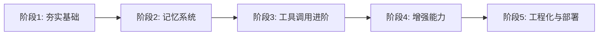

# 学习计划：打造完全体 AI Agent

恭喜你成功跑通了基础 Agent！🎉  
下面是一份从“能用”到“强大”的学习路径，最终目标是构建一个**带长期记忆、动态工具调用、可扩展的完全体 Agent**。

---

## 🗺️ 学习路线图概览

整个计划分为 **5 个阶段**，每个阶段聚焦一个核心能力，最终组合成完整的 Agent 系统。你可以按顺序推进，也可以根据兴趣跳跃学习。

---

## 📚 阶段1：夯实基础（1-2周）
**目标**：深入理解 Agent 的核心循环，掌握 OpenAI SDK 的更多细节，为后续扩展打下基础。

### 学习要点
1. **消息结构再理解**  
   - `system`、`user`、`assistant`、`tool` 四种角色的交互逻辑。
   - 如何构造包含多轮对话和工具调用的 messages。

2. **函数调用（Tool Calling）精讲**  
   - 工具描述的 JSON Schema 详细写法（参数类型、枚举、嵌套对象）。
   - 工具调用 ID 的匹配机制。
   - 处理模型同时调用多个工具（并行工具调用）的逻辑。

3. **流式输出（Streaming）**  
   - 用 `stream=True` 实现逐字输出，提升用户体验。
   - 在流式响应中处理工具调用（当工具调用出现在流中时需特殊处理）。

4. **错误处理与重试**  
   - 捕获 API 异常（如超时、速率限制）并重试。
   - 处理工具执行异常（如函数抛出错误）并反馈给模型。

### 🛠️ 实践项目
- **升级你的天气/计算器 Agent**：
  - 增加流式输出。
  - 增加并行工具调用（例如同时问“北京天气和 123*456”）。
  - 添加简单的错误重试机制。

---

## 🧠 阶段2：构建记忆系统（2-3周）
**目标**：让 Agent 拥有“长期记忆”，能记住用户偏好、历史对话中的关键信息。

### 学习要点
1. **短期记忆 vs 长期记忆**  
   - 短期记忆：用滑动窗口管理对话历史（如只保留最近 N 条消息）。
   - 长期记忆：存储重要信息（用户名称、偏好、事实）到数据库。

2. **向量数据库入门**  
   - 为什么需要向量库？语义搜索与关键词搜索的区别。
   - 常用工具：Chroma（轻量）、Pinecone（云服务）、Qdrant、FAISS。
   - 将文本转换为向量（嵌入）——使用 `text-embedding-3-small` 或其他嵌入模型。

3. **记忆的存取流程**  
   - **存储**：当对话中出现重要信息时（如“我叫张三”），用模型或规则提取并存入向量库。
   - **检索**：每次用户提问前，将用户输入转为向量，从向量库召回相关记忆，作为上下文插入 `system` 或 `user` 消息中。

4. **对话压缩与摘要**  
   - 当对话过长时，自动生成摘要并存储，替代旧消息。

### 🛠️ 实践项目
- **带个人记忆的助手**：
  - 使用 Chroma 作为向量存储。
  - 实现一个简单函数 `extract_facts(text)`，调用模型提取事实（或基于规则）。
  - 对话开始前，检索相关记忆并注入系统提示。
  - 测试：用户第一次说“我喜欢吃辣”，后续问“推荐什么菜”应推荐辣菜。

---

## 🔧 阶段3：工具调用进阶（2-3周）
**目标**：让 Agent 能动态使用工具、组合工具，并处理复杂的工具调用场景。

### 学习要点
1. **动态工具注册**  
   - 不是硬编码工具列表，而是通过装饰器或配置文件动态加载工具。
   - 实现一个工具注册表（dict），key 为工具名，value 为函数。

2. **工具描述的自动生成**  
   - 从函数签名和文档字符串自动生成 JSON Schema（可使用 `pydantic` 或 `inspect` 模块）。

3. **复杂工具参数**  
   - 参数为嵌套对象、数组等复杂结构的描述方法。
   - 如何处理模型返回的参数与预期不符（参数缺失、类型错误）。

4. **工具调用结果的反馈优化**  
   - 如果工具返回错误，如何构造消息让模型重新尝试或给出合理解释。
   - 工具返回数据过大时的截断策略。

5. **权限与安全**  
   - 限制工具可访问的资源（如文件系统、网络）。
   - 对敏感工具添加确认机制（如发送邮件前询问用户）。

### 🛠️ 实践项目
- **多功能办公助手**：
  - 实现一组办公工具：发邮件（模拟）、创建日历事件、搜索网络（模拟）、读写文件（限定沙箱目录）。
  - 动态注册所有工具。
  - 测试复杂指令：“给张三发邮件，说我们明天下午3点开会，并把会议纪要以文本形式保存到本地”。

---

## 🚀 阶段4：增强能力（3-4周）
**目标**：让 Agent 具备规划、多智能体协作等高级能力。

### 学习要点
1. **规划（Planning）**  
   - ReAct 模式的深入：思考-行动-观察循环的优化。
   - 引入规划器（Planner）模块：在复杂任务前，让模型先生成步骤计划，再逐步执行。
   - 使用“子任务分解”技术：将大任务拆分为多个小任务，交给不同工具或子 Agent。

2. **多智能体协作（Multi-Agent）**  
   - 什么是智能体交接（Handoff）：一个 Agent 将任务委托给另一个专业 Agent。
   - 实现方式：可以用工具调用实现（例如 `transfer_to_specialist` 工具）。
   - 消息路由：维护一个 Agent 注册表，根据任务类型选择合适的 Agent。

3. **状态管理与对话树**  
   - 复杂任务可能需要维护状态（如多步骤表单填写）。
   - 使用有限状态机（FSM）管理 Agent 状态（如 `awaiting_confirmation`、`collecting_info`）。

4. **护栏（Guardrails）**  
   - 输入护栏：检查用户输入是否安全、是否在任务范围内。
   - 输出护栏：检查模型输出是否合规，防止注入攻击。

### 🛠️ 实践项目
- **团队协作助手**：
  - 创建三个专业 Agent：天气 Agent、日历 Agent、邮件 Agent。
  - 实现一个总控 Agent，根据用户请求自动交接给相应专业 Agent。
  - 增加规划能力：当用户说“安排明天的会议并通知大家”，总控先生成计划，然后调用日历 Agent 创建事件，调用邮件 Agent 发送通知。

---

## 🏭 阶段5：工程化与部署（2-3周）
**目标**：将 Agent 打包成可靠的服务，支持多用户并发，并具备可观测性。

### 学习要点
1. **会话管理**  
   - 多用户隔离：每个用户有自己的对话历史和记忆空间。
   - 使用用户 ID 作为命名空间，在向量库中标记记忆归属。

2. **API 封装**  
   - 使用 FastAPI 将 Agent 暴露为 RESTful API。
   - 设计请求/响应模型（包含 `session_id`、用户输入等）。

3. **异步处理**  
   - 将长时间运行的 Agent 循环改为异步，避免阻塞。
   - 使用 `asyncio` 或 FastAPI 的异步支持。

4. **可观测性**  
   - 记录日志：每次工具调用、关键决策点。
   - 追踪（Tracing）：可使用 OpenTelemetry 或专用工具（如 LangSmith、Arize）监控 Agent 运行。
   - 性能监控：响应时间、token 消耗、工具成功率。

5. **部署选项**  
   - 本地运行 vs 云部署（AWS、GCP、Azure）。
   - 容器化：使用 Docker 打包 Agent 和依赖。
   - 使用消息队列（如 Redis）处理高并发请求。

### 🛠️ 实践项目
- **生产级智能体 API**：
  - 将阶段4的多智能体系统封装为 FastAPI 应用。
  - 添加用户认证（简单 Token）。
  - 集成日志和监控（如 Prometheus + Grafana）。
  - 用 Docker 部署，并测试并发请求处理能力。

---

## 📦 推荐资源

### 必读文档
- [OpenAI Function Calling 官方指南](https://platform.openai.com/docs/guides/function-calling)
- [OpenAI Agents SDK 文档](https://openai.github.io/openai-agents-python/)（虽然我们没用，但架构思想值得参考）
- [LangChain 如何构建记忆](https://python.langchain.com/docs/modules/memory/)
- [Chroma 向量库快速入门](https://docs.trychroma.com/getting-started)

### 书籍
- 《AI Agents in Action》（Manning 出版社，2025 年出版）- 系统性介绍 Agent 设计模式。
- 《设计数据密集型应用》- 关于状态、存储的工程思想。

### 开源项目参考
- [AutoGPT](https://github.com/Significant-Gravitas/AutoGPT)：看其如何实现长期记忆和规划。
- [OpenAI Cookbook](https://github.com/openai/openai-cookbook)：官方示例，包括函数调用、记忆等。
- [CrewAI](https://github.com/crewAIInc/crewAI)：多智能体编排的简洁实现。

---

## 🎯 建议的学习节奏
- 每天投入 1-2 小时，周末集中实践。
- 每个阶段完成后，写一篇总结博客或笔记，巩固知识。
- 遇到问题时，多利用社区（如 Discord、Reddit 的 r/LocalLLaMA）和 AI 助手（比如我 😊）。

如果你按照这个计划执行，**2-3 个月后**你将拥有一个属于自己的、功能完备的 AI Agent，甚至可以作为简历上的亮点项目。

现在，从**阶段1**开始吧！如果你需要某个阶段更详细的指引，随时告诉我。祝你学习愉快，开发顺利！

支持缓存，支持web后台